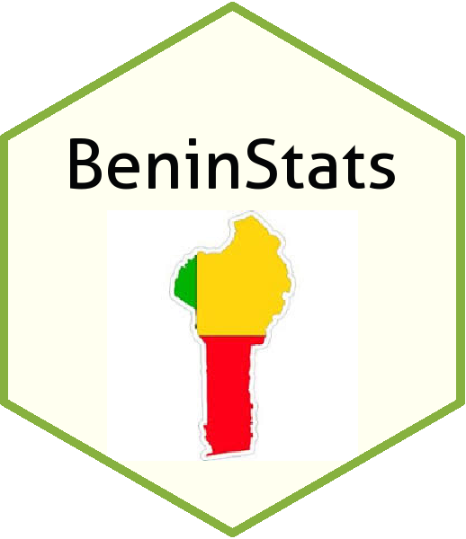

# BeninStats </a>

<!-- README.md is generated from README.Rmd. Please edit that file -->

```{r, include = FALSE}
knitr::opts_chunk$set(
  collapse = TRUE,
  comment = "#>",
  fig.path = "man/figures/README-",
  out.width = "100%"
)
```

# BeninStats

<!-- badges: start -->
[](https://travis-ci.org/Lorx/BeninStats)
[](https://www.tidyverse.org/lifecycle/#experimental)
<!-- badges: end -->

The goal of BeninStats is to collect different data from different sources for Benin Republic.

## Installation

You can install the released version of BeninStats from [CRAN](https://CRAN.R-project.org) with:

``` r
install.packages("BeninStats")
```

And the development version from [GitHub](https://github.com/) with:

``` r
# install.packages("devtools")
devtools::install_github("Lorx/BeninStats")
```
## Example

This is a basic example which shows you how to solve a common problem:

```{r example}
library(BeninStats)
## basic example code
```

What is special about using `README.Rmd` instead of just `README.md`? You can include R chunks like so:

```{r business}
names(pop_by_age)
```

You'll still need to render `README.Rmd` regularly, to keep `README.md` up-to-date.


In that case, don't forget to commit and push the resulting figure files, so they display on GitHub!
