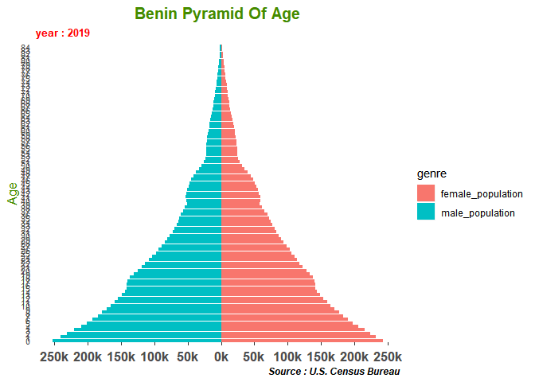

<!-- README.md is generated from README.Rmd. Please edit that file -->

# BeninStats </a>

<!-- badges: start -->

[](https://travis-ci.org/lewishounkpevi/BeninStats)
[](https://www.tidyverse.org/lifecycle/#experimental)
[](https://opensource.org/licenses/MIT)
<!-- badges: end -->

The goal of BeninStats is to collect different data from different
sources for Benin Republic.

## Installation

You can install the released version of BeninStats from
[CRAN](https://CRAN.R-project.org) with:

``` r
install.packages("BeninStats")
```

And the development version from [GitHub](https://github.com/) with:

``` r
# install.packages("devtools")
devtools::install_github("lewishounkpevi/BeninStats")
```

## Example

Benin Republic pyramid of age in 2019:

``` r
library(BeninStats)
suppressPackageStartupMessages(library(dplyr)) 
library(tidyr)
library(ggplot2)

## basic example code
data("pop_by_age")

pop <- pop_by_age %>%
        drop_na() %>%
        filter(annee == 2019) %>%
        select(age, male_population, female_population) %>%
        pivot_longer(cols = c(male_population, female_population),
                     names_to = "genre",
                     values_to = "nbre") %>%

        mutate(nbre = if_else(genre == "male_population", -1*nbre, nbre ),
               age = factor(age, levels = age, labels = age)) %>%
        arrange(genre)


ggplot(pop, aes(x = age, y = nbre, fill = genre)) +
  geom_bar(data = subset(pop, genre == "female_population"), stat = "identity") +
  geom_bar(data = subset(pop, genre == "male_population"), stat = "identity") +
  scale_x_discrete () +
  scale_y_continuous(breaks = seq(-300000, 300000, 50000),
                     labels = paste0(as.character(c(seq(300, 0, -50),
                                                    seq(50, 300, 50))), "k")) +
  coord_flip() +
  labs(title = "Benin Pyramid Of Age",
       x = "Age",
       y = NULL,
       subtitle = "year : 2019",
       caption = "Source : U.S. Census Bureau") +
  theme(plot.subtitle = element_text(size = 10,
    face = "bold", colour = "red", vjust = 1),
    plot.caption = element_text(face = "bold.italic",
        vjust = 1),
    axis.ticks.y = element_line(linetype = "blank"),
    axis.ticks.x = element_line(linetype = "dashed"),
    axis.title = element_text(size = 12,
        colour = "chartreuse4"),
    axis.text.x = element_text(size = 13,
        face = "bold", vjust = 0),
    axis.text.y = element_text(size = 8, angle = 0, face = "plain"),
    plot.title = element_text(size = 15,
        face = "bold", colour = "chartreuse4",
        hjust = 0.5),
    legend.text = element_text(face = "plain"),
    panel.grid.major = element_line(linetype = "blank", colour = NA,  size = 15),
    panel.grid.minor = element_line(linetype = "blank", colour = NA,  size = 15),
    panel.background = element_rect(fill = NA, colour = NA, size = 15)) 
```



What is special about using `README.Rmd` instead of just `README.md`?
You can include R chunks like so:

``` r
names(pop_by_age)
#> [1] "annee"                 "age"                   "both_sexes_population"
#> [4] "male_population"       "female_population"     "percent_both_sexes"   
#> [7] "percent_male"          "percent_female"        "sex_ratio"
```
